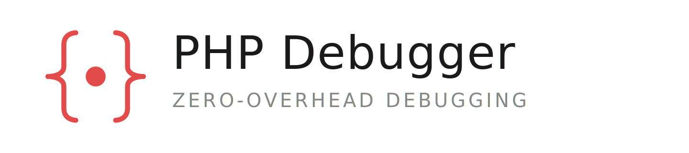

  <picture>
    <source media="(prefers-color-scheme: dark)" srcset="assets/php-debugger-lockup-white.png">
    
  </picture>

PHP Debugger is a step debugger for PHP, and nothing else. Every other feature that
normally ships alongside one — the profiler, the coverage collector, the tracer — has
been left out. What remains is a debugger you can leave switched on permanently,
because when you are not using it you can barely tell it is there. It speaks the DBGp
protocol, so PhpStorm, VS Code and anything else that already debugs PHP works with it,
and it accepts Xdebug's INI settings, triggers and functions, so in most projects there
is nothing to migrate beyond the line that loads the extension.

## Documentation

**[php-debugger.dev](https://php-debugger.dev)** — installation, configuration, IDE
setup and the full reference.

- [Introduction](https://php-debugger.dev/getting-started/introduction)
- [Installation](https://php-debugger.dev/getting-started/installation) · [Docker](https://php-debugger.dev/getting-started/docker)
- [Quick start](https://php-debugger.dev/getting-started/quick-start)
- [User guide](https://php-debugger.dev/user-guide/starting-the-debugger) · [Troubleshooting](https://php-debugger.dev/user-guide/troubleshooting)
- [Settings](https://php-debugger.dev/reference/settings) · [Functions](https://php-debugger.dev/reference/functions) · [Environment variables](https://php-debugger.dev/reference/environment-variables)
- [IDE support](https://php-debugger.dev/integrations/ide-support)

## License

Released under [The Xdebug License](LICENSE), version 1.03 (based on The PHP License).

This product includes Xdebug software, freely available from [https://xdebug.org/](https://xdebug.org/).

## Acknowledgments

PHP Debugger is built on the foundation of [Xdebug](https://xdebug.org/), created and maintained by **Derick Rethans** since 2002. His two decades of work on PHP debugging tools made this project possible. Thank you, Derick.
